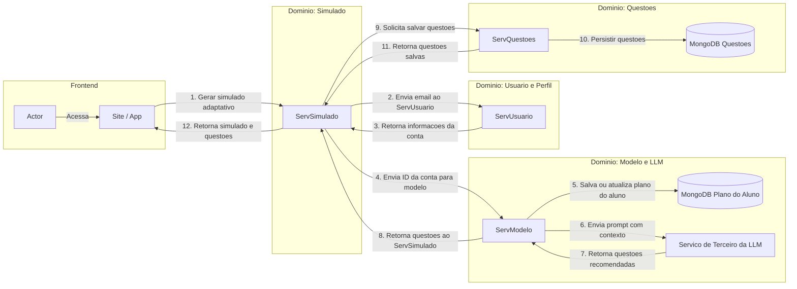

# Diagrama de Interação - MVP Simulado Adaptativo

```mermaid
flowchart LR
  %% Frontend
  subgraph FE["Frontend"]
    A[Actor] -->|Acessa| SITE[Site / App];
  end

  %% Dominio: Simulado
  subgraph SIM["Dominio: Simulado"]
    SS[ServSimulado];
  end

  %% Dominio: Usuario e Perfil
  subgraph USR["Dominio: Usuario e Perfil"]
    SU[ServUsuario];
  end

  %% Dominio: Modelo e LLM
  subgraph MOD["Dominio: Modelo e LLM"]
    SM[ServModelo];
    PLAN[(MongoDB Plano do Aluno)];
    LLM[Servico de Terceiro da LLM];
  end

  %% Dominio: Questoes
  subgraph QST["Dominio: Questoes"]
    SQ[ServQuestoes];
    MDBQ[(MongoDB Questoes)];
  end

  %% Fluxo principal - Criar Simulado Adaptativo
  SITE -->|1. Gerar simulado adaptativo| SS;

  SS -->|2. Envia email ao ServUsuario| SU;
  SU -->|3. Retorna informacoes da conta| SS;

  SS -->|4. Envia ID da conta para modelo| SM;
  SM -->|5. Salva ou atualiza plano do aluno| PLAN;
  SM -->|6. Envia prompt com contexto| LLM;
  LLM -->|7. Retorna questoes recomendadas| SM;
  SM -->|8. Retorna questoes ao ServSimulado| SS;

  SS -->|9. Solicita salvar questoes| SQ;
  SQ -->|10. Persistir questoes| MDBQ;
  SQ -->|11. Retorna questoes salvas| SS;

  SS -->|12. Retorna simulado e questoes| SITE;
```